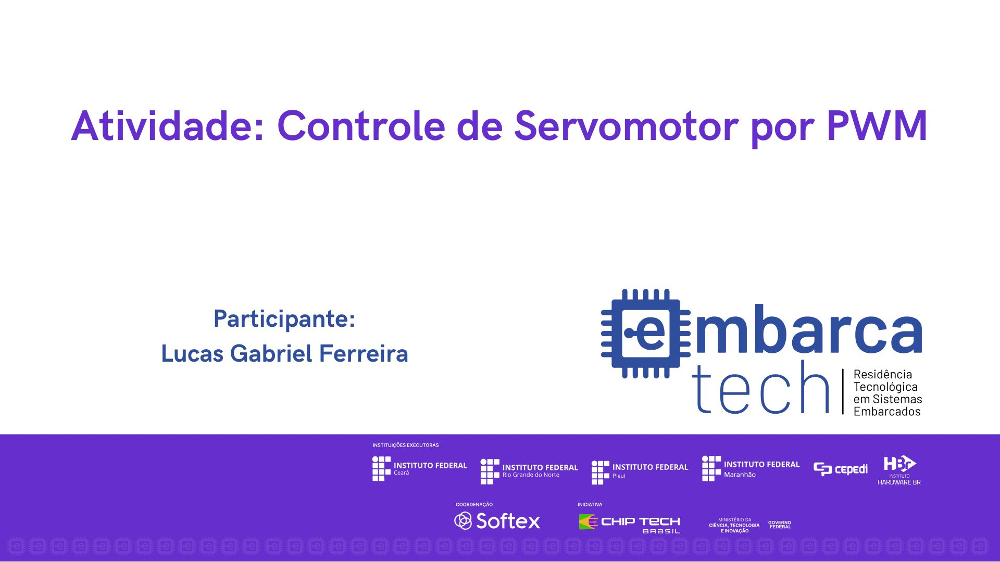

# EmbarcaTech_U4C7T1.

  

## Atividade: Controle de Servomotor por PWM

## Descrição do Projeto

Este projeto tem como objetivo consolidar a compreensão do uso do módulo PWM (Pulse Width Modulation) presente no microcontrolador RP2040 para controlar o ângulo de um servomotor. A prática será realizada utilizando a ferramenta Pico SDK e o simulador online de eletrônica Wokwi.

## Componentes Utilizados

- **Microcontrolador Raspberry Pi Pico W (RP2040)**: Responsável pelo controle do servomotor.
- **Servomotor – Motor Micro Servo Padrão**: Simulado no ambiente Wokwi.

## Ambiente de Desenvolvimento

- **VS Code**: Ambiente de desenvolvimento utilizado para escrever e debugar o código.
- **Linguagem C**: Linguagem de programação utilizada no desenvolvimento do projeto.
- **Pico SDK**: Kit de Desenvolvimento de Software utilizado para programar a placa Raspberry Pi Pico W.
- **Simulador Wokwi**: Ferramenta de simulação utilizada para testar o projeto.

## Guia de Instalação

1. Clone o repositório:
2. Importe o projeto utilizando a extensão da Raspberry Pi.
3. Compile o código utilizando a extensão da Raspberry Pi.
4. Caso queira executar na placa BitDogLab, insira o UF2 na placa em modo bootsel.
5. Para a simulação, basta executar pela extensão no ambiente integrado do VSCode.

## Guia de Uso

O projeto implementa o controle de um servomotor por PWM na GPIO 22 do RP2040, ajustando sua posição conforme os ciclos de trabalho especificados:

1. Frequência do PWM definida para aproximadamente 50Hz (período de 20ms).
2. Posição 180°: Ciclo ativo de 2.400µs (duty cycle de 0,12%), aguardando 5 segundos.
3. Posição 90°: Ciclo ativo de 1.470µs (duty cycle de 0,0735%), aguardando 5 segundos.
4. Posição 0°: Ciclo ativo de 500µs (duty cycle de 0,025%), aguardando 5 segundos.
5. Movimentação periódica: O servomotor oscila entre 0° e 180° com incrementos de ±5µs e atraso de 10ms para uma movimentação suave.

## Testes

Testes básicos foram implementados para garantir que cada componente está funcionando corretamente. 

## Desenvolvedor

[Lucas Gabriel Ferreira](https://github.com/usuario-lider)

## Vídeo da Solução

Clique na imagem abaixo para assistir ao vídeo que demonstra a solução trabalhada e os resultados obtidos nos experimentos:

  

